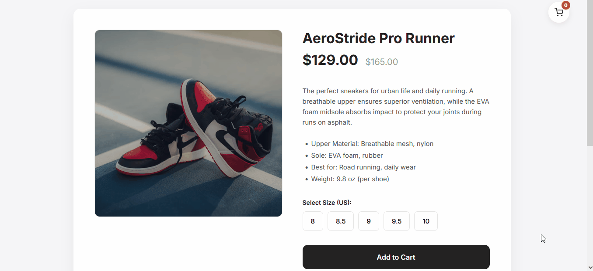

# ClarityCart AI — Autonomous E-commerce Product Advisor Landing Page


## Overview
ClarityCart AI is a lightweight, autonomous product advisor widget designed to embed seamlessly into e-commerce product pages. By instantly answering sizing, material, and policy questions, it effectively reduces cart abandonment and increases conversion rates. This repository contains the high-conversion landing page for the SaaS product.

## Demo


## Key Features
- **Zero-dependency Vanilla JS architecture** with Shadow DOM encapsulation.
- **Autonomous context scraping** (JSON-LD & DOM inspection).
- **High-conversion responsive landing page** with dark-mode aesthetic.
- **Lead capture integration** via Formspree.

## Tech Stack
- HTML5
- Tailwind CSS
- Vanilla JavaScript
- Formspree API
- Vercel

## Local Development
To run this landing page locally, simply follow these steps:

1. Clone the repository:
   ```bash
   git clone https://github.com/agouti-ar/claritycart-landing.git
   cd claritycart-landing
   ```
2. Start a local server:
   - You can use the [Live Server](https://marketplace.visualstudio.com/items?itemName=ritwickdey.LiveServer) extension in VS Code.
   - Alternatively, you can use Python or npx:
     ```bash
     npx serve .
     # or
     python3 -m http.server
     ```
3. Open `http://localhost:3000` (or the port provided by your server) in your browser.

## License
This project is licensed under the MIT License.
